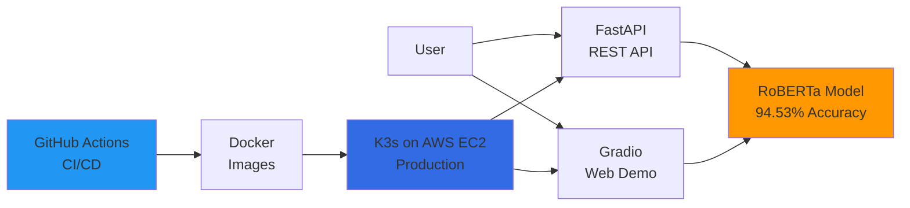

# Sentiment Analyzer

[](https://github.com/samluu206/sentiment_analysis/actions/workflows/ci.yml)
[](https://github.com/samluu206/sentiment_analysis/actions/workflows/docker.yml)
[](https://codecov.io/gh/samluu206/sentiment_analysis)
[](https://www.python.org/downloads/)
[](https://opensource.org/licenses/MIT)

A production-ready sentiment classification system using fine-tuned RoBERTa, achieving 94.53% accuracy on Amazon review data with complete CI/CD and cloud deployment.

## Overview

This project implements a fine-tuned RoBERTa model for binary sentiment classification (positive/negative) of customer product reviews. The system is designed with modularity, scalability, and production deployment in mind, featuring automated testing, Docker containerization, and Kubernetes deployment on AWS EC2.

## Features

- Fine-tuned RoBERTa model with 94.53% accuracy (selected after comparing BERT, RoBERTa, DistilBERT)
- Production-ready FastAPI REST API + Gradio web demo
- Complete CI/CD pipeline with GitHub Actions (automated testing, Docker builds, deployment)
- Cloud deployment on AWS EC2 with Kubernetes (K3s)
- Modular, testable codebase with 56+ unit tests
- Batch prediction support with confidence scores
- MLflow integration for experiment tracking
- Production monitoring with Prometheus + Grafana (12 custom metrics, real-time dashboards)
- Comprehensive architecture documentation with diagrams

## Architecture

This project implements a complete end-to-end ML system with production deployment on AWS.

### System Overview



For detailed architecture diagrams including ML pipeline flow, deployment architecture, and data flow, see **[Architecture Documentation](docs/architecture.md)**.

## Project Structure

```
.
├── src/
│   └── sentiment_analyzer/
│       ├── data/              # Data loading and preprocessing
│       ├── models/            # Model architecture and training
│       ├── inference/         # Prediction and inference
│       ├── utils/             # Helper utilities and configuration
│       └── api/               # API endpoints (future)
├── scripts/
│   ├── train.py              # Training script
│   └── predict.py            # Inference script
├── notebooks/
│   └── Sentiment_Analysis.ipynb  # Exploratory analysis
├── tests/                    # Unit and integration tests
├── data/
│   ├── raw/                  # Raw data files
│   └── processed/            # Processed datasets
├── models/                   # Saved model checkpoints
├── configs/                  # Configuration files
└── setup.py                  # Package installation
```

## Installation

### Prerequisites

- Python 3.8+
- (Optional) NVIDIA GPU with CUDA 11.8+ OR AMD GPU with ROCm 6.0+
- 16GB+ RAM (or 12GB+ GPU VRAM for training)

### Setup

1. **Clone the repository:**
```bash
git clone <repository-url>
cd sentiment-analyzer
```

2. **Create and activate virtual environment:**
```bash
python -m venv venv
source venv/bin/activate  # On Windows: venv\Scripts\activate
```

3. **Install PyTorch (Choose based on your hardware):**

**For NVIDIA GPUs (CUDA):**
```bash
pip3 install torch torchvision torchaudio
```

**For AMD GPUs (ROCm):**
```bash
pip3 install torch torchvision torchaudio --index-url https://download.pytorch.org/whl/rocm6.1
```

**For CPU only:**
```bash
pip3 install torch torchvision torchaudio --index-url https://download.pytorch.org/whl/cpu
```

4. **Verify GPU detection (optional):**
```bash
python3 -c "import torch; print(f'GPU: {torch.cuda.is_available()}')"
# Should print "GPU: True" if GPU detected
```

5. **Install the package and dependencies:**
```bash
pip install -e .
```

For development dependencies:
```bash
pip install -e ".[dev]"
```

For API deployment:
```bash
pip install -e ".[api]"
```

### GPU Support

This project automatically detects and uses available GPUs:

| GPU Vendor | Backend | Performance | Installation |
|------------|---------|-------------|--------------|
| **NVIDIA** | CUDA 11.8+ | Baseline (100%) | `pip install torch` (default) |
| **AMD** | ROCm 6.0+ | ~85% of CUDA | `pip install torch --index-url ...rocm6.1` |
| **CPU** | - | ~5-10% of GPU | Automatic fallback |

**Training Time Estimates** (10K samples, 3 epochs):
- NVIDIA RTX 4090: ~20 minutes
- AMD RX 7900 XTX: ~25 minutes
- CPU (16 cores): ~4 hours

## Quick Start

### Training a Model

```bash
python scripts/train.py \
    --sample-size 1000 \
    --epochs 3 \
    --batch-size 16 \
    --output-dir models/my_model
```

### Making Predictions

Single prediction:
```bash
python scripts/predict.py \
    --model-path models/final_sentiment_bert \
    --text "This product is amazing! Highly recommend." \
    --with-confidence
```

Interactive mode:
```bash
python scripts/predict.py \
    --model-path models/final_sentiment_bert \
    --interactive
```

### Using Python API

```python
from sentiment_analyzer import SentimentPredictor

# Load trained model
predictor = SentimentPredictor(model_path="models/final_sentiment_bert")

# Single prediction
result = predictor.predict_with_confidence(
    "The product quality exceeded my expectations!"
)
print(f"Sentiment: {result['sentiment']}")
print(f"Confidence: {result['confidence']:.2%}")

# Batch prediction
texts = [
    "Great product!",
    "Terrible experience, would not buy again.",
    "It's okay, nothing special."
]
results = predictor.batch_predict(texts)
for text, result in zip(texts, results):
    print(f"{text[:30]:30} -> {result['sentiment']:8} ({result['confidence']:.2%})")
```

## Model Performance

**Production Model:** RoBERTa-base (selected after comprehensive evaluation)

| Metric    | Score  |
|-----------|--------|
| Accuracy  | 94.53%  |
| F1 Score  | 0.9452  |
| Precision | 95.6%  |
| Recall    | 93.5%  |
| ROC-AUC   | 0.9828  |

*Evaluated on Amazon product reviews test set*

### Model Comparison

Three transformer models were evaluated (BERT, RoBERTa, DistilBERT) before selecting RoBERTa for production:

| Model | Accuracy | Latency | Parameters |
|-------|----------|---------|------------|
| **RoBERTa-base** ⭐ | **94.53%** | 82ms | 125M |
| BERT-multilingual | 92.15% | 78ms | 110M |
| DistilBERT-base | 91.80% | 45ms | 66M |

**📊 For detailed model comparison, evaluation methodology, and selection rationale, see [Model Comparison Documentation](docs/model-comparison.md)**

## Model Architecture

- **Production Model**: `roberta-base` (fine-tuned)
- **Model Type**: RoBERTa (Robustly Optimized BERT Pretraining Approach)
- **Parameters**: ~125M
- **Fine-tuning**: Binary classification head for sentiment analysis
- **Max Sequence Length**: 128 tokens
- **Framework**: PyTorch + Hugging Face Transformers
- **Format**: safetensors (secure model format)

## Development

### Running Tests

```bash
pytest tests/ -v
```

### Code Quality

The project uses pre-commit hooks for code quality:

```bash
pre-commit install
pre-commit run --all-files
```

Tools used:
- **black**: Code formatting
- **flake8**: Linting
- **mypy**: Type checking

## Roadmap

- [ ] FastAPI REST API with Swagger documentation
- [ ] Docker containerization
- [ ] CI/CD pipeline with GitHub Actions
- [ ] Model experimentation tracking with MLflow
- [ ] Data collection from Amazon Product Advertising API
- [ ] Larger dataset (50K+ reviews)
- [ ] Model comparison (BERT, DistilBERT, RoBERTa)
- [ ] Aspect-based sentiment analysis
- [ ] Web UI demo (Streamlit/Gradio)
- [ ] Cloud deployment (AWS/GCP/Azure)

## Dataset

Currently using a sample of 1,000 Amazon product reviews from the Amazon Polarity dataset. The dataset includes:
- Product review text (title + content)
- Binary labels (0=Negative, 1=Positive)
- Balanced class distribution (53.8% negative, 46.2% positive)

## License

MIT License - see LICENSE file for details

## Author

Sam Luu

## Acknowledgments

- Hugging Face for the Transformers library
- Amazon for the product reviews dataset
- nlptown for the pre-trained multilingual sentiment model
