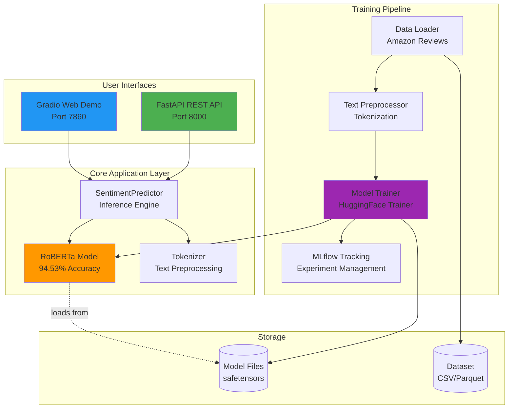
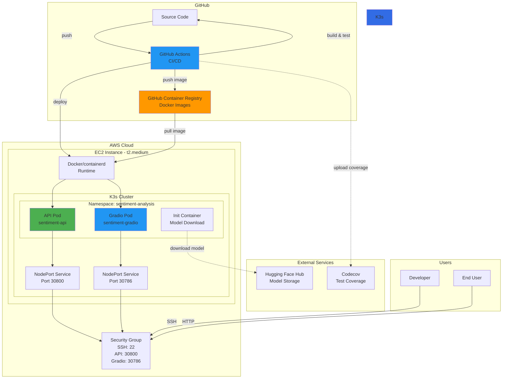
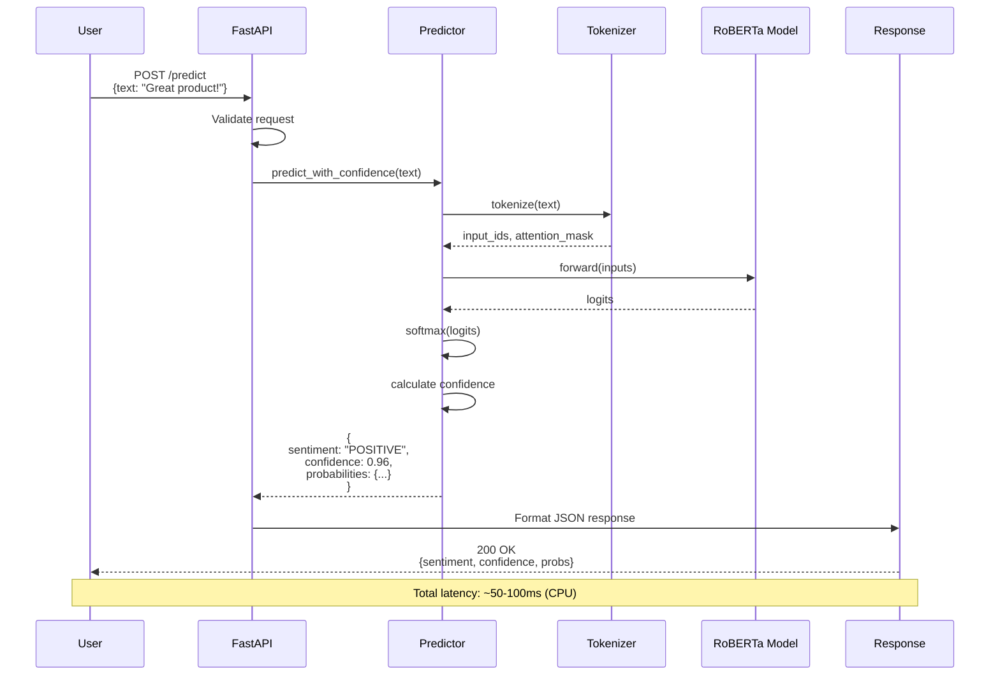
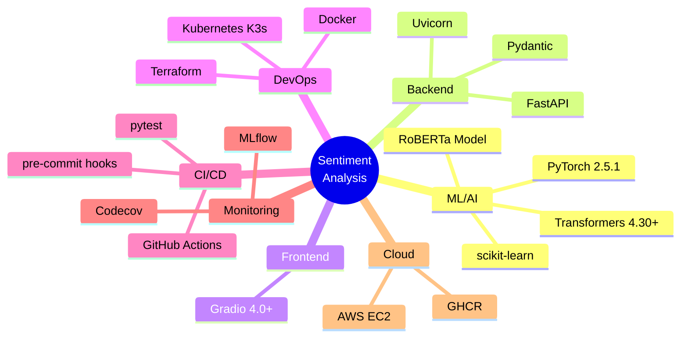
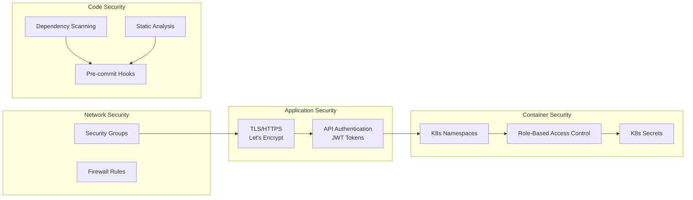

# Architecture Documentation

This document provides detailed architecture diagrams for the Sentiment Analysis system.

## Table of Contents
- [System Architecture](#system-architecture)
- [ML Pipeline Flow](#ml-pipeline-flow)
- [Deployment Architecture](#deployment-architecture)
- [Data Flow](#data-flow)

---

## System Architecture

High-level overview of all system components and their interactions.



**Key Components:**

- **FastAPI REST API**: Production-ready REST endpoints with `/predict` and `/batch_predict`
- **Gradio Web Demo**: Interactive web interface for testing and demonstrations
- **SentimentPredictor**: Inference engine handling single and batch predictions
- **RoBERTa Model**: Fine-tuned transformer model achieving 94.53% accuracy
- **Training Pipeline**: Complete ML pipeline from data loading to model deployment

---

## ML Pipeline Flow

End-to-end machine learning workflow from data collection to model deployment.

```mermaid
flowchart LR
    subgraph "1. Data Collection"
        Amazon[Amazon Product<br/>Reviews API]
        HF[HuggingFace<br/>Datasets]
    end

    subgraph "2. Data Processing"
        Validate[Data Validation<br/>Quality Checks]
        Clean[Data Cleaning<br/>Preprocessing]
        Split[Train/Val/Test<br/>Split 60/20/20]
    end

    subgraph "3. Model Training"
        Tokenize[Tokenization<br/>Max Length 128]
        Train[Fine-tune RoBERTa<br/>3 Epochs]
        Evaluate[Evaluation<br/>Metrics Calculation]
    end

    subgraph "4. Experiment Tracking"
        Track[MLflow Tracking<br/>Params & Metrics]
        Compare[Model Comparison<br/>BERT vs RoBERTa]
    end

    subgraph "5. Model Deployment"
        Save[Save Model<br/>safetensors format]
        Registry[Model Registry<br/>Version Control]
        Deploy[Deploy to Production<br/>API + Gradio]
    end

    Amazon --> Validate
    HF --> Validate
    Validate --> Clean
    Clean --> Split
    Split --> Tokenize
    Tokenize --> Train
    Train --> Evaluate
    Train --> Track
    Evaluate --> Track
    Track --> Compare
    Compare --> Save
    Save --> Registry
    Registry --> Deploy

    style Train fill:#FF9800
    style Deploy fill:#4CAF50
    style Track fill:#9C27B0
```



**Pipeline Stages:**

1. **Data Collection**: Sourced from Amazon Product Reviews dataset via HuggingFace
2. **Data Processing**: Validation, cleaning, and stratified splitting
3. **Model Training**: Fine-tuning RoBERTa with supervised learning
4. **Experiment Tracking**: MLflow for reproducibility and comparison
5. **Model Deployment**: Production deployment with versioning

---

## Deployment Architecture

Complete deployment infrastructure on AWS EC2 with Kubernetes (K3s).



**Infrastructure Components:**

- **GitHub Actions**: Automated CI/CD pipeline (testing, building, deployment)
- **GitHub Container Registry**: Docker image storage and versioning
- **AWS EC2**: Cloud compute instance running K3s cluster
- **K3s**: Lightweight Kubernetes distribution for production deployment
- **NodePort Services**: External access to API (30800) and Gradio (30786)
- **Init Containers**: Download model from Hugging Face Hub before startup
- **Security Groups**: Firewall rules controlling inbound/outbound traffic

---

## Data Flow

Real-time inference request flow through the system.



**Request Flow:**

1. **User Request**: HTTP POST to `/predict` endpoint with review text
2. **Validation**: FastAPI validates request schema using Pydantic
3. **Tokenization**: Text converted to token IDs with attention masks
4. **Inference**: RoBERTa model processes tokens and outputs logits
5. **Post-processing**: Softmax applied, confidence scores calculated
6. **Response**: JSON response with sentiment, confidence, and probabilities

---

## Technology Stack



---

## Key Design Decisions

### 1. Model Selection: RoBERTa over BERT
- **Accuracy**: 94.53% vs ~92% for BERT
- **Robustness**: Better handling of informal review text
- **Speed**: Comparable inference time on CPU

### 2. Deployment: K3s over Full Kubernetes
- **Lightweight**: Lower resource overhead for single-node deployment
- **Cost-effective**: Runs efficiently on t2.medium instance
- **Production-ready**: Battle-tested Kubernetes distribution

### 3. Container Strategy: Init Containers for Models
- **Separation of concerns**: Build-time vs runtime dependencies
- **Flexibility**: Model updates without image rebuilds
- **Storage efficiency**: No large model files in Docker images

### 4. API Framework: FastAPI over Flask
- **Performance**: ASGI async support for better concurrency
- **Documentation**: Auto-generated OpenAPI/Swagger docs
- **Type safety**: Pydantic validation reduces runtime errors

### 5. CI/CD: GitHub Actions over Jenkins
- **Simplicity**: Native GitHub integration
- **Cost**: Free for public repositories
- **Maintenance**: No separate server to manage

---

## Performance Characteristics

| Metric | Value | Notes |
|--------|-------|-------|
| **Model Accuracy** | 94.53% | On Amazon review test set |
| **Inference Latency** | 50-100ms | CPU inference (single request) |
| **Throughput** | ~20 req/s | Single pod, no GPU |
| **Model Size** | 500 MB | RoBERTa-base safetensors |
| **Memory Usage** | ~1.5 GB | Per pod with model loaded |
| **Cold Start** | ~15s | Model download + loading |

---

## Scalability Considerations

### Horizontal Scaling
```yaml
# Increase replicas in K8s deployment
replicas: 3  # Scale to 3 pods
```

### Vertical Scaling
- Upgrade EC2 instance type (t2.medium → t2.large)
- Add GPU support for faster inference (g4dn.xlarge)

### Auto-scaling
- Horizontal Pod Autoscaler based on CPU/memory
- AWS Auto Scaling Groups for multi-node clusters

---

## Security Architecture



**Security Layers:**

1. **Network**: Security groups restricting inbound traffic
2. **Application**: HTTPS encryption, API authentication
3. **Container**: Namespace isolation, RBAC, secret management
4. **Code**: Dependency scanning, static analysis, quality gates

---

## Monitoring & Observability

**Production monitoring stack with Prometheus + Grafana.**

### Metrics Tracked

- **API Performance**: Latency (p50/p95/p99), throughput, error rates
- **ML Metrics**: Prediction distribution, confidence scores, batch sizes
- **System Health**: Model status, resource usage, request patterns

### Dashboard Features

- 12 visualization panels (time series, gauges, heatmaps, pie charts)
- Real-time updates (10s refresh)
- 7-day metric retention
- SLA monitoring with configurable thresholds

**For detailed monitoring documentation, see [docs/monitoring.md](monitoring.md)**

### Access Points

- **Prometheus**: `http://<EC2_IP>:30900` - Metrics collection & queries
- **Grafana**: `http://<EC2_IP>:30300` - Visual dashboards & analytics

---

## Future Enhancements

- [x] Add Prometheus + Grafana monitoring ✅
- [ ] Implement A/B testing framework
- [ ] Add automated model drift detection
- [ ] Implement caching layer (Redis)
- [ ] Multi-model support (BERT, DistilBERT)
- [ ] GPU acceleration for inference
- [ ] Automated alerting with AlertManager
- [ ] Database integration for prediction logging
- [ ] Real-time streaming with Kafka
- [ ] Feature store integration
- [ ] Distributed tracing (OpenTelemetry/Jaeger)
